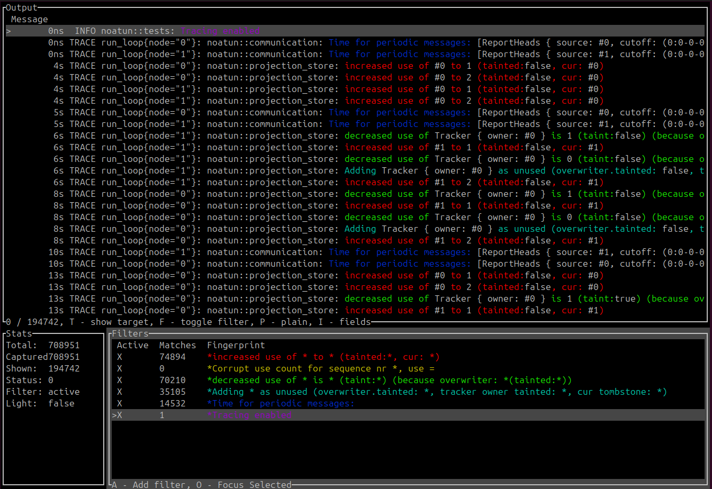

# Log Driller

Log Driller is a tool to interactively view and filter output from a running application.
It's in early development. The main use case is analysing the output from rust applications,
but it can be used with any application that writes to `stdout` or `stderr`.



It has a very special feature - adding automatic search expressions through your
IDE. Once started, Log Driller watches your source folder (by default, the current
directory, but you can override this using the `--source` parameter). Whenever
a `//` is added to the end of a line, any string literal on that line is parsed
and added as a search expression. Log Driller then filters the client application
output (in real time), only showing matching output lines.

The main use case is debugging complex applications that use rust logging/tracing.
Enabling all trace output is likely to yield an overwhelming amount of output. However,
using the `RUST_LOG` environment variable to reduce the output can be tedious, and
there is always the risk of accidentally removing log lines that would actually 
have been interesting.

Using Log Driller, you would typically enable all (or most) log output, then filter
by exploring your source code, adding `//` to the end of lines containing interesting
traces, and observing in Log Driller if these occur. Log driller will by default 
limit the number of captured lines to 1 million, with good performance.

## Usage

Make sure `logdriller` is in your `PATH`, then use it something like this:

```RUST_LOG=trace logdriller -- cargo run test <my test> -- --nocapture```

Then, observe your output. Edit lines in the code (adding `//` at the end)
to automatically add search expressions.

## Key bindings

`Q` - Quit

`Esc` - Quit

`Tab` - Select filter pane/output pane

`A` - Manually add search expression

`Space` - Activate/deactivate current fingerprint(/search expression)

`S`/`Pause` - Pause updates (temporarily ignore client application output)

`F` - Enable/disable filter

`O`- Scroll to current 'fingerprint'(/search expression).

`L` - Toggle light mode/dark mode

`PgUp`/`PgDown` - Scroll up/down

`Up`/`Down` - Scroll up/down

`Left`/`Right` - Scroll output left/right

## Feature wishlist:

 * Search also in un-filtered view
 * Properly support target, filenames, namespaces, trace level, and tracing fields, with searching


